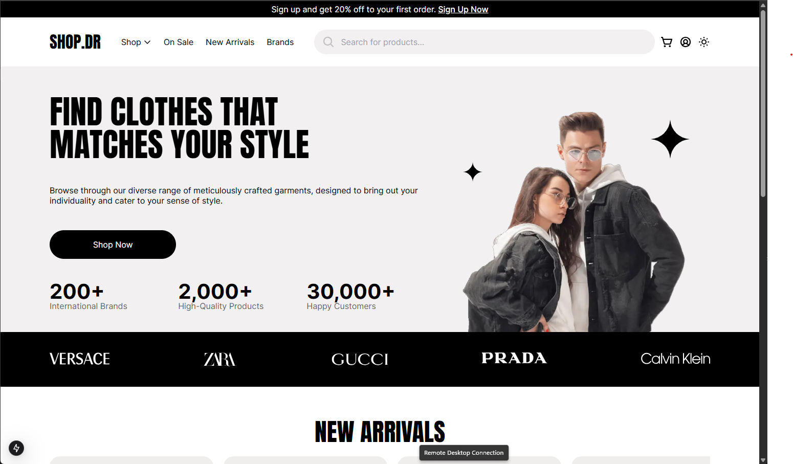

# Shop.Dr - E-commerce Platform

 <!-- Add your screenshot here -->

## 🛍️ Overview
A modern e-commerce platform built with **Next.js**, **TypeScript**, and **Tailwind CSS**, featuring:
- 🛒 Product catalog with categories
- 🔍 Advanced search functionality
- 💳 Secure checkout process
- 🌓 Dark/light mode toggle
- 📱 Fully responsive design

➡️ **Live Demo**: [https://shop-dr.liara.run/](https://shop-dr.liara.run/) 

## ✨ Key Features
| Feature | Description |
|---------|-------------|
| **Next.js Optimized** | Server-side rendering for fast page loads |
| **TypeScript** | Type-safe codebase for better maintainability |
| **Tailwind CSS** | Utility-first styling for rapid UI development |
| **DaisyUI Components** | Pre-built accessible UI components |
| **Figma Designed** | Pixel-perfect implementation from design mockups |

## 🛠 Tech Stack
### Frontend
-  Next.js 13 (App Router)
-  TypeScript 5+
-  Tailwind CSS 3
-  DaisyUI

## 🚀 Getting Started
1. Clone the repository:
```bash
git clone https://github.com/githubmor/shop.dr.git
